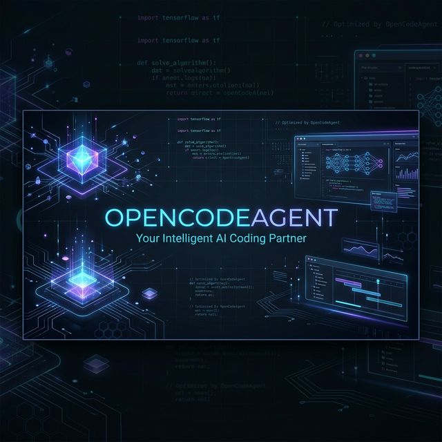
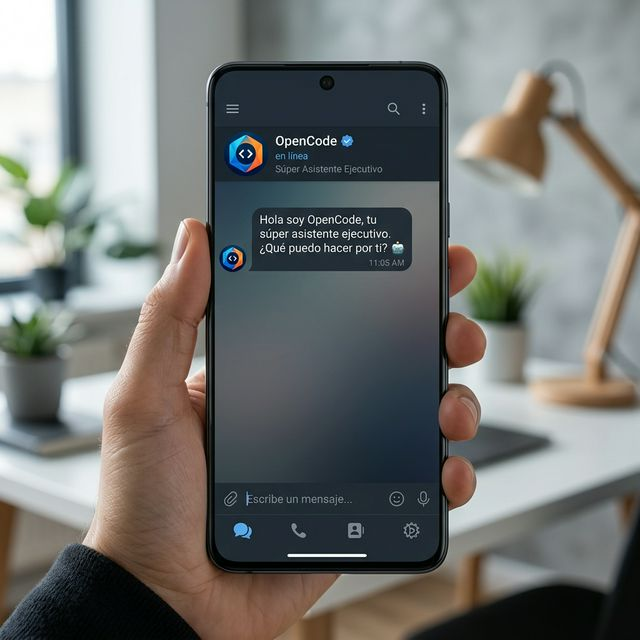

# 🚀 Guía Maestra de Instalación - OpenCodeAgent



Bienvenido a **OpenCodeAgent**, el asistente de inteligencia artificial definitivo para WhatsApp/Telegram, potenciado con capacidades de Google Workspace y modelos de lenguaje de última generación.

Esta guía te llevará de la mano para configurar tu propia instancia desde cero, ya sea para uso personal o para desplegarla a un cliente.

---

## 📑 Índice
1. [Prerrequisitos](#-1-prerrequisitos)
2. [Configuración de Telegram](#-2-configuración-de-telegram)
3. [Cerebro de IA (OpenRouter)](#-3-cerebro-de-ia-openrouter)
4. [Configuración de Google Workspace](#-4-configuración-de-google-workspace)
5. [Voz y Audio (ElevenLabs)](#-5-voz-y-audio-elevenlabs)
6. [Instalación y Despliegue](#-6-instalación-y-despliegue)

---

## 🛠 1. Prerrequisitos
Antes de empezar, asegúrate de tener:
- Una cuenta de **Telegram**.
- Una cuenta de **OpenRouter** (para los modelos de IA).
- Una cuenta de **Google Cloud Console**.
- **Docker** instalado (recomendado para despliegue rápido).
- Una cuenta en **Railway.app** (si vas a desplegar en la nube).

---

## 🤖 2. Configuración de Telegram
Para que el agente pueda hablar contigo, necesitas crear un bot oficial.

1. Abre Telegram y busca a **@BotFather**.
2. Escribe `/newbot` y sigue las instrucciones para ponerle nombre.
3. Al finalizar, recibirás un **API TOKEN**. Guárdalo, lo necesitaremos para el archivo `.env`.
4. Busca tu propio ID de usuario usando el bot **@userinfobot**. Esto servirá para que solo TÚ (o tu cliente) podáis usar el bot.



---

## 🧠 3. Cerebro de IA (OpenRouter)
OpenCodeAgent utiliza una arquitectura híbrida:
- **Visión**: Google Gemini 2.0 Flash (rápido y económico).
- **Texto**: GPT-4o mini o Llama 3.

1. Ve a [OpenRouter.ai](https://openrouter.ai/) y crea una cuenta.
2. Genera una **API Key**. Esto permitirá al bot "pensar".

---

## 📂 4. Configuración de Google Workspace
Esta es la parte más potente: permitir que el bot use Drive, Gmail y Calendar.

### Paso A: Google Cloud Console
1. Crea un nuevo proyecto en [Google Cloud Console](https://console.cloud.google.com/).
2. Habilita las siguientes APIs:
   - Google Drive API
   - Gmail API
   - Google Calendar API
   - Google Sheets API

### Paso B: Cuenta de Servicio
1. En "IAM y Administración" > "Cuentas de servicio", crea una nueva.
2. Crea una **Clave JSON** y descárgala. Renómbrala como `service-account.json` y ponla en la raíz de la carpeta del proyecto.
3. **Importante**: Comparte la carpeta de Drive o los calendarios que quieras que el bot use con el email de esa cuenta de servicio.

---

## 🎙 5. Voz y Audio (ElevenLabs) - Opcional
Si quieres que el bot hable con voces naturales:
1. Regístrate en [ElevenLabs](https://elevenlabs.io/).
2. Obtén tu API Key. 
*Si no la pones, el bot usará un sistema de voz gratuito por defecto.*

---

## 🚀 6. Instalación y Despliegue

### Opción A: Escritorio (Local)
1. Clona la carpeta.
2. Crea un archivo `.env` basado en el `.env.example`.
3. Ejecuta:
   ```bash
   npm install
   npm run dev
   ```

### Opción B: Nube (Railway) - Recomendado
1. Instala Railway CLI: `npm i -g @railway/cli`.
2. Login: `railway login`.
3. Vincular: `railway link`.
4. Desplegar: `railway up`.
5. En el panel de Railway, crea un **Volume** montado en `/app/data` para que el bot no pierda la memoria al reiniciarse.

---

*Desarrollado con ❤️ para facilitarte la vida.*
